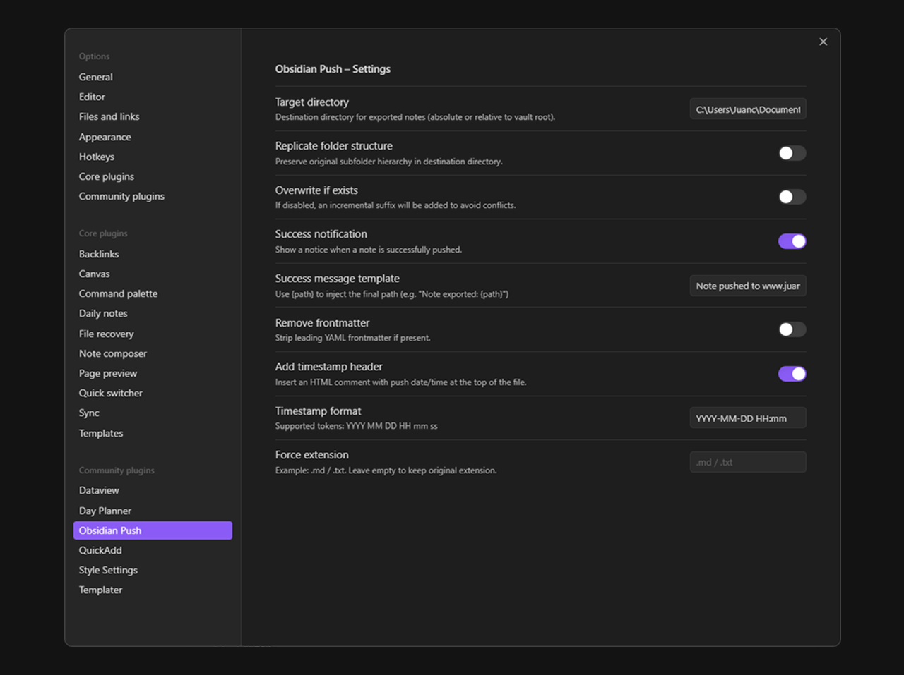
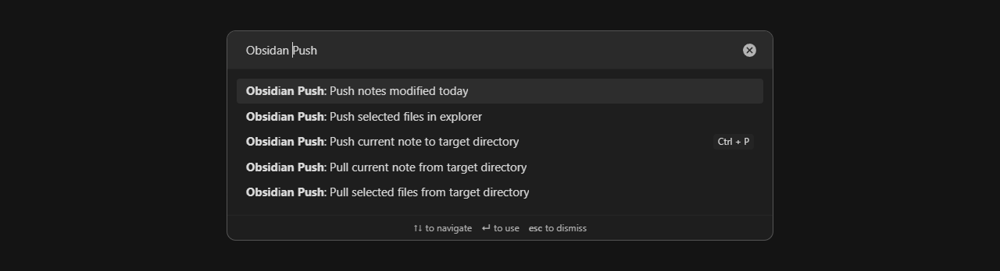

# Obsidian Push

A Obsidian plugin to push and pull notes and folders between your vault and any directory

## Features
- Push and pull notes (current/selected)
- Keep folder structure or flatten to the target root
- Optional transforms: remove YAML frontmatter, add timestamp, force extension
- Prevent overwrites with auto suffixes
- Customizable success notification
- Desktop-only

## Getting started

> [!NOTE] 
> I built this plugin for personal use and don't plan to submit it to Community Plugins. Similar plugins already exist.

- Download the plugin folder (containing at least `manifest.json` and `main.js`)
- Copy that folder to .obsidian/plugins/obsidian-push/
- Enable it in Settings → Community plugins

## Contributions

Contributions are welcome! If you encounter a problem or have an idea to improve the project, open an issue or send a pull request
